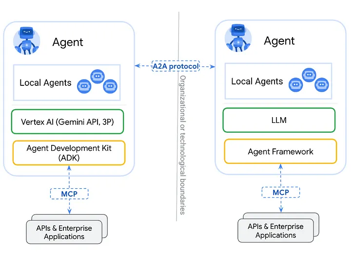

# Agent To Agent Protocol - A2A

# What's A2A 

***Agent to Agent Protocol - A2A*** is an open protocol, enables **agents** to show each other their capabilities and negotiate how they will interact with the user. 

- **MCP** in simple terms was about giving AI flexible access to tools, **A2A** is about letting agents discover and collaborate with each other.

